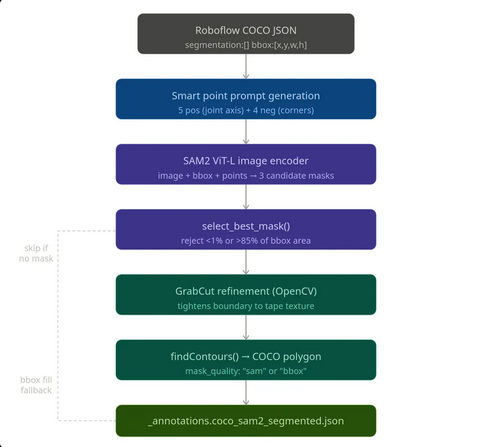
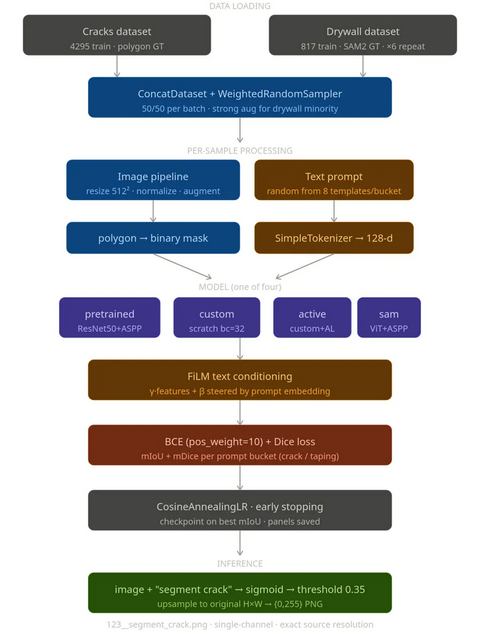
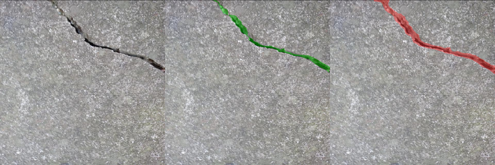
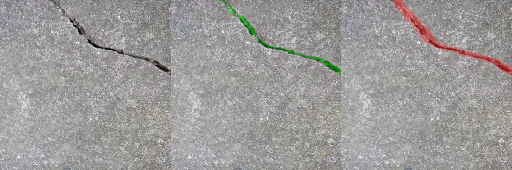
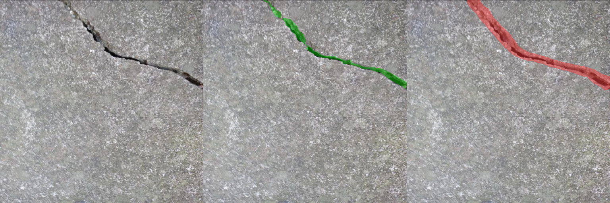
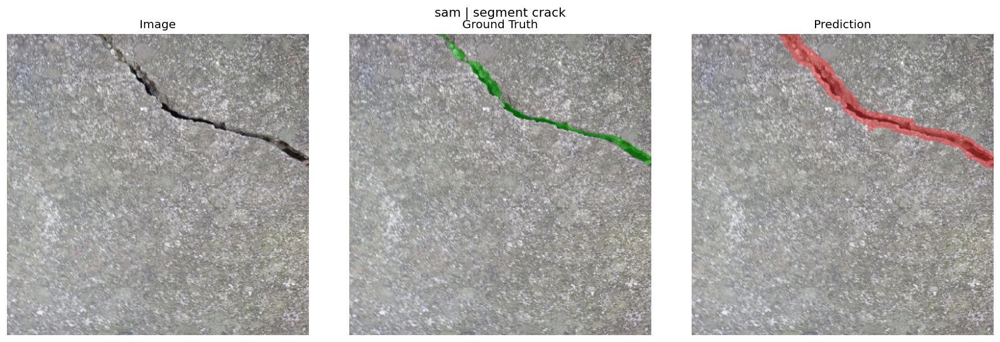

# Text-Conditioned Segmentation for Crack and Drywall Defect Detection

A FiLM-conditioned semantic segmentation pipeline that detects two structural
defect classes — **surface cracks** and **drywall taping** — from a single
text-prompted model. Four architectures are benchmarked under identical training
conditions on an **NVIDIA A5000 GPU**.

---

## Dataset

| Split | Images | Annotation |
|---|---|---|
| Cracks train | 4,295 | Polygon GT — COCO JSON (Roboflow) |
| Drywall train | 817 (×6 oversample) | SAM2 pseudo-labels |
| Eval — crack | n = 536 | — |
| Eval — taping | n = 102 | — |

### SAM2 Pseudo-Label Pipeline (Drywall)

Because drywall images had bounding-box annotations only, SAM2-ViT-L was used
to generate polygon masks automatically.



1. **Smart point prompts** — 5 positive (joint axis) + 4 negative (corners)
2. **SAM2-ViT-L** → 3 candidate masks
3. **`select_best_mask()`** — from valid masks (1%–85% of bbox area), pick the highest SAM confidence score; if none pass, relax the upper bound and pick the smallest above the minimum
4. **GrabCut refinement** (OpenCV) — tightens boundary to tape texture
5. **`findContours()`** → COCO polygon; bbox-fill fallback if no valid mask

> **Limitation:** SAM2 masks tend to over-fill or miss narrow tape boundaries,
> injecting label noise that currently caps taping-class IoU.

---

## Pipeline



```
ConcatDataset (cracks + drywall)
    → WeightedRandomSampler (50/50 per batch, strong aug on drywall minority)
    → Image resize 512², normalise (ImageNet stats)
    → Text prompt (SimpleTokenizer → 128-d embedding, 8 templates/bucket)
    → MODEL
    → FiLM conditioning: γ(z)·f + β(z)  [GroupNorm + ReLU]
    → BCE (pos_weight=10) + Dice loss
    → CosineAnnealingLR · save best-mIoU checkpoint
    → Inference: sigmoid → threshold 0.35 → bilinear upsample to original H×W
```

---

## Model Architectures

### 1. Pretrained DeepLabV3

- **Backbone**: torchvision `deeplabv3_resnet50`, COCO-with-VOC weights
- Final `1×1` classifier head and auxiliary head replaced with binary (1-channel) outputs
- **FiLM injection point**: applied to the **256-ch ASPP decoder features** before the
  final `1×1` head — the `DeepLabHead` layers `[0:4]` run first (ASPP → Conv→BN→ReLU),
  FiLM modulates the 256-ch output, then layer `[-1]` projects to 1 channel.
  This ensures γ and β operate on the correct feature dimension.
- Auxiliary head follows the same split during training.
- **Trainable**: 18.6 M of 42.1 M total params | **160 MB**

### 2. Custom DeepLabV3 (from scratch)

Full DeepLabV3 built from scratch, base-channel `bc = 32`.

**Backbone** — ResNet-like encoder, output stride 8:
- 7×7 stem → ×4 downsample
- Stride-2 stage → ×8 total
- 2 dilated stages (dilation 2 then 4) — maintain ×8, expand receptive field
- Output channels: `bc × 8 = 256`

**ASPP** — parallel dilated convs at rates {1, 6, 12, 18} + global avg pool →
concat → project to 256 ch with `Dropout2d(p=0.5)` *(training regulariser only — not a MC-Dropout layer)*

**Forward order**:
```
backbone → mc_drop1 → ASPP → FiLM → mc_drop2 → Decoder
```
FiLM runs on the **complete 256-ch ASPP output before mc_drop2**, so
γ·f + β sees unperturbed features. mc_drop2 then adds stochasticity on the
conditioned features entering the decoder — this is the meaningful uncertainty
source for active learning.

**Decoder** — `256 → 128 → 64` ConvBnReLU → `1×1` head → bilinear upsample

**5.76 M params | 22 MB**

### 3. Active Learning Variant (MC-Dropout)

Same architecture as Custom DeepLabV3, extended for uncertainty-based querying:

- `Dropout2d(p=0.3)` — **mc_drop1** after backbone output
- `Dropout2d(p=0.3)` — **mc_drop2** after FiLM, before decoder

At query time:
```python
model.eval()           # BatchNorm uses running stats
model.enable_dropout() # activates ONLY mc_drop1 + mc_drop2
                       # ASPP Dropout2d(p=0.5) stays off
```
T stochastic forward passes estimate prediction variance; most uncertain
unlabelled samples are selected for annotation each round.

Results reported: **round 5** (10 fine-tuning epochs/round on the actively selected subset).

**5.76 M params | 22 MB**

### 4. SAM Adapter

- **Encoder**: SAM ViT-L — **frozen** (0 trainable params in encoder)
- Input images resized to `1024×1024` before encoding
- Encoder output: 256-ch dense embeddings at H/16 × W/16 (64×64)
- **FiLM injection point**: applied to the **256-d SAM encoder embeddings** before decoding
- **BinaryDecoder**: ASPP at rates {1, 6, 12, 18} + GAP → project to 128 ch
  with `Dropout2d(0.3)` → `64→1` conv blocks → bilinear upsample to original res
- **Trainable**: 1.17 M of 90.8 M total params | **347 MB**
- Training stopped at epoch 6 (~21 min/epoch on A5000)

---

## Results

### Combined Dataset (crack + taping)

| Model | mIoU | mDice | Crack IoU | Taping IoU | Params | Size |
|---|---|---|---|---|---|---|
| **Pretrained** | **0.5772** | **0.7319** | 0.5718 | **0.5826** | 42.1 M / 18.6 M | 160 MB |
| Custom | 0.4712 | 0.6399 | 0.4371 | 0.5054 | 5.76 M / 5.76 M | 22 MB |
| Active rd.5 | 0.4144 | 0.5860 | **0.4222** | 0.4067 | 5.76 M / 5.76 M | 22 MB |
| SAM† | 0.3871 | 0.5572 | 0.4232 | 0.3511 | 90.8 M / 1.17 M | 347 MB |

> † Encoder frozen; stopped at epoch 6.

### Runtime (NVIDIA A5000)

| Model | Total | Avg/epoch | Epochs |
|---|---|---|---|
| Pretrained | 73.1 min | 219.3 s | 20 |
| Custom | 37.2 min | 111.5 s | 20 |
| Active (5 rounds) | ~35.5 min | 42.8 s | 10 × 5 |
| SAM | ~2.5 h | 1,247 s | 6 (stopped) |

---

## Qualitative Predictions

Each panel: **original image | ground-truth mask (green) | prediction (red)**

**Pretrained**


**Custom**


**Active rd.5**


**SAM**


**Common failure:** All models produce masks wider than the hairline crack.
`pos_weight=10` biases training toward recall, and standard normalisation
suppresses thin dark features. All four models do correctly localise the
crack corridor.

---

## Key Observations

- **Best accuracy**: Pretrained ResNet-50+ASPP (mIoU 0.5772, mDice 0.7319) —
  ImageNet priors + correctly placed FiLM on 256-ch ASPP features.
- **Best efficiency**: Custom model at 22 MB achieves mIoU 0.4712 — 10.6 mIoU
  points behind pretrained at 7× fewer parameters.
- **Active learning**: Competitive crack IoU (0.4222) on a smaller actively
  selected labelled subset; more rounds expected to close the gap further.
- **SAM**: Massive encoder with a tiny trainable decoder; early stopping at
  epoch 6 limits conclusions — full training may yield stronger results.
- **Drywall label quality** remains the single largest bottleneck; taping IoU
  correlates directly with annotation precision.

---

## Hyperparameters Used

- **Input resolution**: 512×512 with ImageNet normalization — standardizes training and improves convergence.  
- **Batch size**: 16 — balances GPU utilization and stability.  
- **Optimizer**: Adam with learning rate 1e−4 and weight decay 1e−4 — stable convergence with regularization.  
- **Scheduler**: Cosine annealing (η_min = 1e−6) — smooth learning rate decay.  
- **Loss function**: BCE + Dice (equal weights, pos_weight = 10) — handles class imbalance and improves segmentation quality.  
- **Backbone**: Frozen during initial training — preserves pretrained features and reduces overfitting.  
- **Active learning**: 5 rounds, 10% query per round, 10 MC passes — uncertainty-based sample selection.  
- **SAM configuration**: ViT-B backbone, LR = 3e−4, batch size = 4 — constrained by GPU memory.  
- **Inference threshold**: 0.35 — tuned for better recall on thin structures.  
- **Random seed**: 42 — ensures reproducibility across splits and training.  
